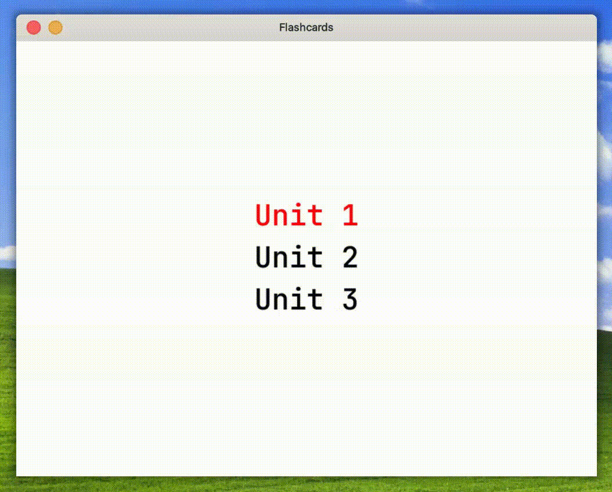

# C-flashcards

A simple flashcard app that allows you to view flashcards, rendered in SDL2. The flashcards are stored in a .txt file, with a tab separating the front and back of the cards.

###### TODO
add card nums in the bottom.
